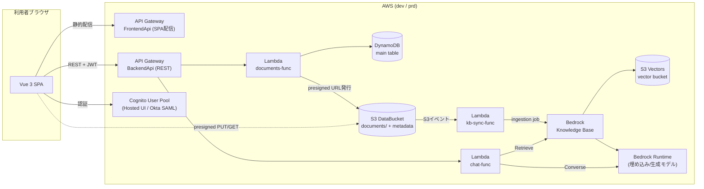
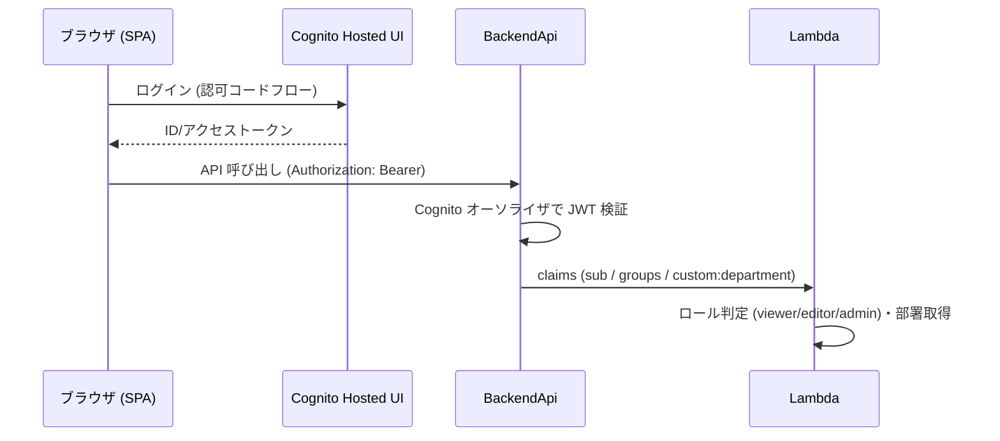

# 基本設計書 — 社内ナレッジ・ドキュメント管理システム

| 項目 | 内容 |
|---|---|
| 文書番号 | KNW-DOC-02 |
| 作成者 | Fable |
| 版数 | 1.0 |
| 関連文書 | 01 要件定義書 / 03 詳細設計書 / 06・07 構成図 |

---

## 1. システム全体構成



### 1.1 設計方針

1. **文書管理 (ガバナンス層) と RAG (検索層) の分離**: 権限・タグ・版・監査は自前 (DynamoDB + S3)、ベクトル化・検索は Bedrock KB に委譲する
2. **ベクトルストアは S3 Vectors**: 常時課金が発生せず、ストレージ + リクエストの純従量。低〜中頻度の社内利用に最適。将来の高負荷時は OpenSearch Serverless へのエクスポートで移行可能
3. **権限とメタデータフィルタの連動**: 文書登録時に S3 へメタデータサイドカーファイルを併置し、KB 取り込み時にフィルタ可能メタデータ化。チャット API はユーザーの属性 (部署・ユーザー ID) からフィルタ式を組み立てて Retrieve する
4. **CI/CD テンプレート準拠**: モノレポ (`frontend/` + `backend/`)、paths-filter + ダミー成功ジョブ、OIDC ロール、dev/prd 環境分離をそのまま踏襲する

## 2. 方式設計

### 2.1 フロントエンド

| 項目 | 採用技術 | 備考 |
|---|---|---|
| フレームワーク | Vue 3 (Composition API) + TypeScript | |
| ビルド | Vite | |
| 状態管理 | Pinia | auth / documents / chat の 3 ストア |
| UI | Element Plus | テーブル・フォーム・アップロード部品を活用 |
| 認証 | AWS Amplify (Auth カテゴリ) | Hosted UI リダイレクト方式 |
| 配信 | API Gateway → S3 (テンプレートの FrontendApi 方式) | `/app` プレフィックス配下 + `bk/` 世代バックアップ |

### 2.2 バックエンド

| 項目 | 採用技術 | 備考 |
|---|---|---|
| API | API Gateway (REST) + Cognito オーソライザ | CORS はオリジン限定 (prd) |
| 実行環境 | Lambda / Python 3.13 | Lambda Powertools (Logger / Metrics / Idempotency)。Tracer は不使用 (規約: lambda-python-instructions「Tracer 規約」) |
| データストア | DynamoDB シングルテーブル | オンデマンドキャパシティ |
| ファイル | S3 (presigned URL 方式) | クライアント直接 PUT/GET、Lambda 経由でファイル本体を流さない |
| RAG | Bedrock Knowledge Bases (S3 Vectors) | Retrieve + Converse の 2 段構成 (フィルタ制御のため RetrieveAndGenerate は使わない) |
| IaC | AWS SAM | KB / S3 Vectors は CloudFormation 対応状況を構築時に確認し、未対応リソースは手順書 (08) による構築とする |

### 2.3 認証・認可方式



- ロール: Cognito グループ (`admin` / `editor`)。グループ無所属は viewer
- 部署: カスタム属性 `custom:department`。Okta SAML 連携時は SAML 属性マッピングで供給
- Lambda は API Gateway が検証済みの claims のみを信頼し、クライアント送信値でロール・部署を判定しない

### 2.4 RAG 権限制御方式 (本システムの中核)

1. 文書アップロード完了時、`documents-func` が S3 に `<オブジェクトキー>.metadata.json` を生成する
   - 内容: `docId` / `visibility` / `department` / `ownerId` / `title` / `tags`
2. KB データソース同期時、サイドカーの属性がフィルタ可能メタデータとしてベクトルに付与される
3. `chat-func` は質問者の claims から以下のフィルタ式を構築して `Retrieve` を実行する

```text
orAll:
  - visibility = "public"
  - andAll: [ visibility = "department", department = <質問者の部署> ]
  - andAll: [ visibility = "private",    ownerId    = <質問者の sub> ]
```

4. 取得チャンクを根拠として Converse API で回答を生成し、出典 (docId → 文書詳細画面リンク) を付けて返す

この方式により、権限判定は「生成前の検索段階」で完結し、LLM のプロンプト指示に依存しない。

### 2.5 KB 同期方式

| トリガ | 方式 |
|---|---|
| 文書追加・更新・削除 | S3 イベント → `kb-sync-func` → `StartIngestionJob`。連続更新に備え、実行中ジョブがあればスキップし EventBridge Scheduler の定期実行 (15 分間隔) で追随 |
| 手動同期 (admin) | `POST /kb/sync` → 同 Lambda |
| 同期状態 | `GET /kb/status` で直近の ingestion job の状態・統計を返す |

削除は「S3 オブジェクト削除 → 次回同期でベクトルからも削除」の結果整合とする (要件上、削除の即時反映は要求しない)。

## 3. データ設計 (概要)

DynamoDB シングルテーブル。詳細なキー設計は「03 詳細設計書」を参照。

| エンティティ | 主な属性 |
|---|---|
| 文書 (Document) | docId, title, description, tags[], department, visibility, ownerId, latestVersion, s3Key, fileType, size, createdAt, updatedAt |
| 版 (Version) | docId, version, s3Key, uploadedBy, uploadedAt, note |
| タグ (Tag) | tagName, count |
| チャット履歴 (Chat) | userId, timestamp, question, answer, citations[] |
| 監査ログ (Audit) | date, timestamp, userId, action, docId, detail, ttl |

## 4. 環境構成

| 環境 | 用途 | デプロイ契機 |
|---|---|---|
| dev | 結合確認・デモ | `dev` ブランチへの push (自動) |
| prd | 本番 | `main` ブランチへの push (自動 / Environment 承認) |

- スタック名: `pjxxx-knowledge-system-dev` / `-prd` (環境別接尾辞)
- Bedrock KB は環境ごとに独立して構築する (dev の同期テストが prd の検索結果に影響しないこと)

## 5. 段階リリース計画

| フェーズ | 範囲 |
|---|---|
| Phase 1 (MVP) | 認証、文書 CRUD、タグ・部署検索、presigned DL、KB 同期、RAG チャット (public のみ) |
| Phase 2 | 権限フィルタ (department/private)、版管理、監査ログ、同期状態画面 |
| Phase 3 | チャット履歴、Okta SAML、コストダッシュボード、OpenSearch 移行手順の整備 |
