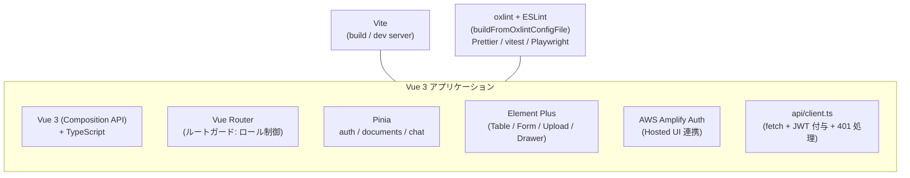
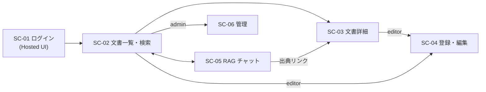
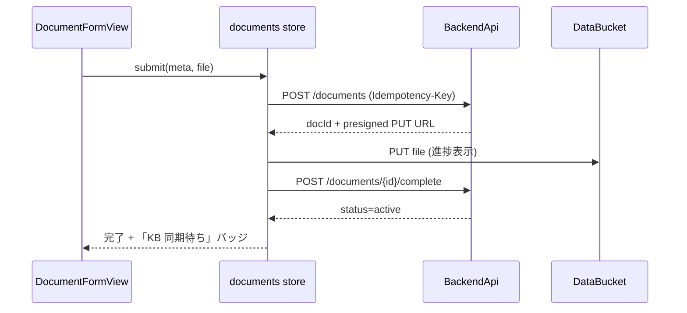
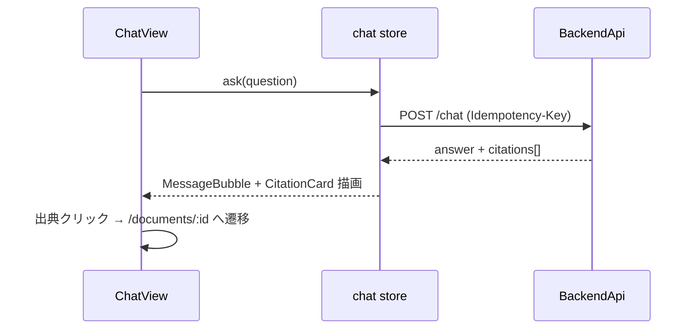

# フロントエンド構成図 — 社内ナレッジ・ドキュメント管理システム

| 項目 | 内容 |
|---|---|
| 文書番号 | KNW-DOC-06 |
| 作成者 | Fable (改訂: Claude Code) |
| 版数 | 1.0 |

---

## 1. 技術スタック構成



## 2. ディレクトリ構成

`vue-directory-structure` 規約に従い **Feature-Based** を採用する (本システムは 6 画面 / feature 4 つの中規模構成であり、規約の判断表・規模目安のいずれでも Feature-Based に該当)。feature 間の直接 import は全面禁止とし、共有が必要になったものは `shared/` へ昇格させる。

```text
frontend/
├── src/
│   ├── features/
│   │   ├── documents/            # 文書管理 (SC-02/03/04)
│   │   │   ├── views/            # DocumentListView / DocumentDetailView / DocumentFormView
│   │   │   ├── components/       # DocumentTable / TagFilter / UploadDropzone / VersionList
│   │   │   ├── composables/      # useDocumentSearch / useUpload (presigned 2段階)
│   │   │   ├── services/         # documentsApi.ts
│   │   │   ├── stores/           # useDocumentStore (一覧・検索条件・ページング)
│   │   │   ├── types/
│   │   │   ├── routes.ts
│   │   │   └── index.ts          # 公開インターフェース (router からはここ経由)
│   │   ├── chat/                 # RAG チャット (SC-05)
│   │   │   ├── views/            # ChatView
│   │   │   ├── components/       # ChatWindow / MessageBubble / CitationCard / HistoryDrawer
│   │   │   ├── composables/      # useChat (質問送信・Idempotency-Key 採番)
│   │   │   ├── services/         # chatApi.ts
│   │   │   ├── stores/           # useChatStore
│   │   │   ├── types/
│   │   │   ├── routes.ts
│   │   │   └── index.ts
│   │   ├── auth/                 # 認証 (SC-01)
│   │   │   ├── views/            # LoginView
│   │   │   ├── routes.ts
│   │   │   └── index.ts
│   │   └── admin/                # 管理 (SC-06)
│   │       ├── views/            # AdminView
│   │       ├── components/       # SyncStatusPanel / TagManager / AuditTable
│   │       ├── services/         # adminApi.ts
│   │       ├── routes.ts
│   │       └── index.ts
│   ├── shared/
│   │   ├── api/                  # client.ts (axios + JWT 付与 + camelCase↔snake_case + 401 処理)
│   │   ├── stores/               # useAuthStore (claims / ロール / 部署。全 feature から参照するため shared/ に配置)
│   │   ├── types/                # 共通型 (ApiError / PaginatedResponse / Role / Visibility)
│   │   └── views/                # ForbiddenView (403) / NotFoundView (404)
│   ├── router/index.ts           # 各 feature の routes.ts を集約 / meta.requiredRole ガード
│   └── main.ts
├── e2e/                          # Playwright (3 ロール権限シナリオ)
└── vite.config.ts
```

依存方向は規約どおり `features/* → shared/` のみを許可する。文書詳細への遷移をチャットの出典カードから行う導線は、`features/chat` から `features/documents` を import せず **ルーター経由 (`router.push({ name: 'document-detail' })`) で疎結合に実現** する。

## 3. 画面遷移図



- チャットの出典カードから文書詳細へ遷移できる導線が本システムの特徴 (回答→原典確認の往復を最短化)

## 4. データフロー (代表 2 ケース)

### 4.1 文書アップロード



### 4.2 RAG チャット



## 5. 認証状態管理

- 起動時に Amplify でセッション復元 → `shared/stores/useAuthStore` に claims (sub / groups / department) を格納。全 feature が import 禁止ルールに抵触せず参照できるよう `shared/` に昇格させている
- ルートガード: 未認証 → Hosted UI へリダイレクト / ロール不足 → 403 画面
- API 401 応答時はトークン更新を 1 回試行し、失敗時は再ログイン誘導
- 画面上のロール制御 (ボタン非表示等) は UX 目的であり、権限の最終判定は常にサーバ側で行う

## 6. 配信構成

```text
ブラウザ ──HTTPS──> API Gateway (FrontendApi)
                      ├─ GET /app/{proxy+} ──> S3 frontend バケット app/ 配下
                      └─ 404/深いパス ──────> index.html (SPA フォールバック)

デプロイ: GitHub Actions → npm ci → build (--mode dev|production)
          → 旧世代を bk/<timestamp>/ へ退避 (3 世代) → app/ へ s3 sync --delete
```
