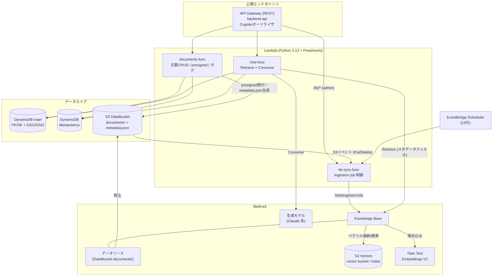
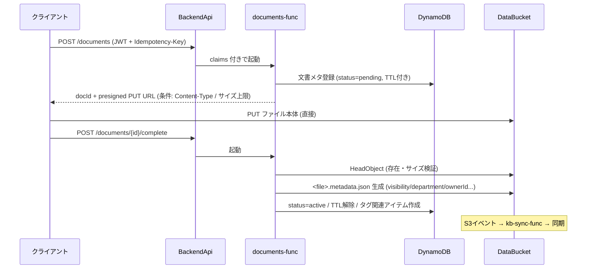
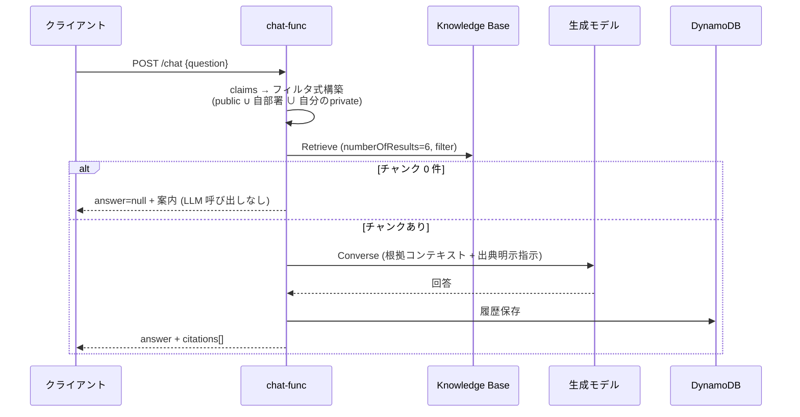

# バックエンド構成図 — 社内ナレッジ・ドキュメント管理システム

| 項目 | 内容 |
|---|---|
| 文書番号 | KNW-DOC-07 |
| 作成者 | Fable |
| 版数 | 1.0 |

---

## 1. 全体構成図



## 2. リクエスト処理フロー

### 2.1 文書登録 (2 段階コミット)



設計意図: ファイル本体を Lambda に通さない (6MB 制限・コスト回避)。pending 放置は TTL で自動掃除。

### 2.2 RAG チャット (権限フィルタ付き)



## 3. IAM 権限設計 (最小権限)

| ロール | 許可 (代表) | リソース限定 |
|---|---|---|
| documents-func-role | dynamodb:Query/GetItem/PutItem/UpdateItem/DeleteItem | main table + `index/*` |
| | s3:PutObject/GetObject/DeleteObject/HeadObject | `arn:${AWS::Partition}:s3:::<data-bucket>/documents/*` |
| chat-func-role | bedrock:Retrieve | KB ARN |
| | bedrock:InvokeModel | 推論プロファイル + 基盤モデル ARN |
| | dynamodb (履歴・Idempotency) | 対象テーブルのみ |
| kb-sync-func-role | bedrock:StartIngestionJob/GetIngestionJob/ListIngestionJobs | KB / データソース ARN |
| KB サービスロール | s3:GetObject/ListBucket (DataBucket documents/*) + S3 Vectors 読書 + 埋め込みモデル InvokeModel | 各リソース ARN |

共通規約: ワイルドカードリソース禁止 (CloudWatch Logs 等の例外のみ)、`arn:${AWS::Partition}:` でパーティション非依存に構築。

## 4. 同期制御の詳細

```text
S3イベント (Put/Delete on documents/)
        │
        ▼
kb-sync-func ── ListIngestionJobs で実行中ジョブ確認
        │
        ├─ 実行中なし → StartIngestionJob (即時反映)
        └─ 実行中あり → スキップ (DynamoDB に pending フラグ)
                              │
EventBridge (15分) ───────────┴→ pending あれば StartIngestionJob
```

- ingestion job は KB 単位で直列のため、多重起動を避けるガードを持つ
- 削除反映: S3 から消えたオブジェクトは次回 ingestion で KB からも削除される (結果整合)
- 失敗時: `IngestionJobFailed` メトリクス → アラーム → SNS 通知 (P2)

## 5. Python パッケージ構成

```text
backend/
├── src/
│   ├── documents/handler.py       # APIGatewayRestResolver (#1〜#9)
│   ├── chat/handler.py            # #10, #11
│   ├── kb_sync/handler.py         # S3/EventBridge/#12/#13
│   └── shared/
│       ├── models.py              # Pydantic モデル (Document / ChatRequest ...)
│       ├── auth.py                # claims 解析・ロール/部署抽出
│       ├── ddb.py                 # シングルテーブル操作
│       ├── kb_filter.py           # メタデータフィルタ式構築 (単体テスト重点)
│       └── s3util.py              # presigned / metadata.json 生成
├── tests/                         # pytest + moto
├── template.yaml                  # SAM (KB 関連は Parameters で ID 注入)
└── samconfig.toml                 # dev/prd (スタック名は環境別接尾辞)
```

- KB / データソース ID は手順書 (08) で構築後、SAM の Parameter (`KnowledgeBaseId`, `DataSourceId`) として注入する

## 6. 監視・ログ

| 項目 | 内容 |
|---|---|
| 構造化ログ | Powertools Logger (JSON)。correlation_id = API GW requestId |
| トレース | Tracer 不使用 (規約)。aws-xray-sdk が 2027-02 EOL のため。Powertools の OTEL ベース Tracer 正式リリース時に再導入を検討 (Phase 3) |
| メトリクス | ChatRequests / ChatNoHit / IngestionJobFailed / PresignedIssued |
| アラーム (prd) | ingestion 失敗、chat-func エラー率、API 5xx 率 |
