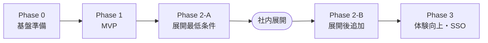

# 全体作業計画 (Phase 0〜3) — 社内ナレッジ・ドキュメント管理システム

| 項目 | 内容 |
|---|---|
| 文書番号 | KNW-DOC-11 |
| 作成者 | Fable |
| 版数 | **1.1** |
| 位置づけ | 全フェーズの段取り・完了条件・依存関係。Phase 1 の詳細は KNW-DOC-09 v2.0 |

## v1.0 → v1.1 改訂内容 (KNW-DOC-11-Review の指摘反映)

| 指摘 | 反映 |
|---|---|
| 1. Phase 0-1 完了条件が曖昧 | 部分採用: 0-1 タスク行に完了条件 3 項目を明記 (prd 承認ゲート検証を追加)。Phase 0 全体の完了条件は v1.0 から維持 |
| 2. Phase 2 が重すぎる | **全面採用**: Phase 2 を 2-A (展開最低条件) / 2-B (展開後追加) に分割 |
| 3. ADR が「随時」 | **全面採用**: ADR-001〜004 を Phase 0-3 と同時作成に変更 |
| (追加) 監査ログの位置 | 2-B 配置としつつ、**2-A 着手前の確認事項** を新設 (社内セキュリティ基準次第で 2-A へ昇格) |

---

## フェーズ全体像

| フェーズ | ゴール | 主な成果 |
|---|---|---|
| Phase 0 | 開発が回る状態 | リポジトリ・CI/CD・AWS 基盤・KB (dev)・ADR |
| Phase 1 | 使える最小形 | 文書 CRUD + RAG チャット (public のみ) |
| Phase 2-A | **社内展開できる最低条件** | 権限フィルタ完成・admin 運用可視化 |
| Phase 2-B | 展開後の充実 | 版管理・監査ログ・タグ管理 |
| Phase 3 | 完成形 | 履歴・Okta SAML・コスト可視化・移行手順 |

---

## Phase 0 — 基盤準備

| # | 作業 | 状態 |
|---|---|---|
| 0-1 | CI/CD テンプレート (レビュー_修正済みv2) の最終検証。**完了条件**: (1) 空の PR で frontend-ci / backend-ci の全ジョブが緑 (2) dev ブランチへのマージで空の SAM スタックが dev へデプロイされる (3) prd デプロイに GitHub Environments の承認ゲートが効いていることを実際に 1 回承認して確認。加えて Claude Code `/memory` でルール読込確認、Copilot チャットの References に instructions ファイルが表示されることを確認 | **未 (最優先)** |
| 0-2 | 新リポジトリ作成 + テンプレート展開 (モノレポ: frontend/ + backend/)、Branch Protection / Ruleset、GitHub Environments (dev / prd) | 未 |
| 0-3 | 設計ドキュメント一式 (01〜08 rev1.1) を `docs/` に配置。09 v2.0 の設計書反映タスク (03 snake_case 化 / 06 useAuthStore 配置) を実施。**同時に ADR-001〜004 を作成** (下表) | 未 |
| 0-4 | AWS 側前提: OIDC プロバイダ・デプロイロール (dev/prd)、SAM アーティファクトバケット、Bedrock モデルアクセス有効化 (Titan Embed V2 / Claude 系) | 未 |
| 0-5 | KB 構築 (08 手順書、dev 環境): S3 Vectors バケット + インデックス + KB + データソース。`KB_ID` / `DS_ID` を控える | 未 |
| 0-6 | コスト防衛: コスト配分タグ設計、AWS Budgets (dev: 3,000 円 / prd: 10,000 円)、**OpenSearch Serverless コレクションが存在しないことの確認をチェックリスト化** | 未 |

### 0-3 で作成する ADR

| ADR | 決定内容 (非採用案と理由を必ず併記) |
|---|---|
| ADR-001 | ベクトルストア: S3 Vectors 採用 / OpenSearch Serverless 非採用 (アイドル時固定費 月数万円) |
| ADR-002 | RAG 実装方式: Retrieve + Converse 採用 / RetrieveAndGenerate 非採用 (メタデータフィルタと引用制御を自前で握るため) |
| ADR-003 | Cognito: UserPoolTier LITE 採用 / Essentials 非採用 (MAU 課金回避。脅威防御が必要になったら PLUS を再評価) |
| ADR-004 | フロントエンド構成: Feature-Based 採用 / Type-Based 非採用 (規約準拠・チーム分担・feature 独立性)。**設計書がいったん Type-Based で書かれ規約との突き合わせで是正された経緯を記録し、「実装判断は規約を一次情報とする」教訓として残す** |

**Phase 0 完了条件**: 空の main ブランチに対する PR で CI が全ジョブ緑になり、dev への自動デプロイ (空 SAM スタック) が成功し、prd 承認ゲートの動作を確認済み。ADR-001〜004 がコミットされている。

---

## Phase 1 — MVP

詳細は **KNW-DOC-09 v2.0** を参照 (v2 実装への追加修正は KNW-DOC-13 の指示 a〜d を完了させること)。

| 領域 | 内容 |
|---|---|
| バックエンド | documents-func (#1〜#9) / chat-func (#10、履歴は保存のみ) / kb-sync-func (イベント起動のみ) / 共通 Layer (kb_filter は public 固定配線 + orAll 完全版を生きたコードで維持) |
| フロントエンド | auth / documents / chat の 3 feature + shared。vitest 3 本 + E2E 2 本 |
| インフラ | template.yaml 全面書き換え (KB Parameters / DataBucket CORS 含む) |

**完了条件**: 文書登録 → 15 分以内に RAG 回答へ反映 / public 固定フィルタの適用をテストとログで確認 / CI 緑 (pytest・vitest とも skip 0 件) / アイドルコスト想定内。

---

## Phase 2-A — 社内展開の最低条件

> これが完了した時点で社内展開する。2-B を待たない。

### 2A-1. 権限フィルタ完成 (F-211 / F-303) — 本システムの価値の核

| 作業 | 内容 |
|---|---|
| kb_filter 配線切替 | `build_retrieval_filter` を `build_full_filter` (orAll) へ切り替え (KNW-DOC-13 指示 b の構造なら return 1 行) |
| 文書側 | visibility (public/department/private) の入力 UI・バリデーション、metadata.json への反映 |
| 検索側 | 一覧 API (#3) にも同一の権限判定を適用 (DynamoDB クエリ結果のフィルタ) |
| E2E | **3 ロール × 権限外文書が「一覧・詳細・DL・チャット出典」の全経路で見えないこと** (最重要シナリオ) |

### 2A-2. admin feature + KB 運用可視化 (F-402〜404)

- API #12 (手動同期) / #13 (同期状態) の実装 (kb_sync_handler に追加)
- `features/admin` (AdminView / SyncStatusPanel)
- CloudWatch アラーム (IngestionJobFailed / API 5xx) + SNS 通知

### 2-A 着手前の確認事項 (社内基準の確認)

> **監査ログ (F-501〜502) を 2-A に含めるべきかを情シス/セキュリティ部門に確認すること。**
> 「権限管理された文書システムには操作証跡が展開の前提」という内規がある場合、2B-2 を 2-A に昇格させる。確認結果を本書に追記して確定する。

**Phase 2-A 完了条件**: 権限 E2E 全緑 / 同期失敗が通知される / 部署の異なるテストユーザー 3 名での受入確認 / (昇格した場合) 監査ログの記録確認 → **社内展開判定**。

---

## Phase 2-B — 展開後に順次追加

展開を止めずに 1 機能ずつリリースする。

### 2B-1. 版管理 (F-210)

- API #7 (新版 presigned) の有効化、`VER#` アイテム運用、詳細画面に版一覧・過去版 DL
- 新版アップロード時の metadata.json 差し替えと KB 再同期の確認

### 2B-2. 監査ログ (F-501〜502) ※ 2-A 昇格の可能性あり (上記確認事項)

- 登録/更新/削除/DL/チャットの DynamoDB 監査アイテム記録 (TTL 1 年)
- admin 向け閲覧 API + AuditTable 画面

### 2B-3. タグ管理 (F-212)

- タグ統合・リネーム (関連アイテムの付け替えバッチ)

**Phase 2-B 完了条件**: 各機能の E2E 追加分が緑 / 監査ログが全操作で記録される。

---

## Phase 3 — 体験向上・SSO・運用成熟

### 3-1. チャット履歴 (F-305〜306)

- API #11 有効化、HistoryDrawer、履歴からの再質問 (`ChatHistoryItem` 型の復元)

### 3-2. Okta SAML 連携 (F-105)

| 作業 | 内容 |
|---|---|
| Okta 側 | Integrator Free Plan で SAML アプリ作成 → メタデータ URL 取得 (手順は運用手順書に記載) |
| Cognito 側 | SAML IdP 登録、属性マッピング (email / department → custom:department)、アプリクライアントの IdP 有効化 |
| 検証 | Okta ユーザーでのログイン → 部署フィルタが SAML 属性由来で機能すること |

### 3-3. 運用成熟

- コスト可視化 (F-503〜504): タグ別 Cost Explorer 手順・月次チェックの運用手順書化
- 検索品質評価: チャンク戦略 (固定 512 vs 階層) の自データ比較、numberOfResults 調整
- 負荷増大時の出口: S3 Vectors → OpenSearch Serverless エクスポート手順の検証 (実施はトリガー条件を満たした場合のみ)
- Powertools の OTEL ベース Tracer のリリース状況確認と再導入評価 (現行は規約により Tracer 不使用)

**完了条件**: Okta 経由ログインで全機能が動作 / 運用手順書 (Runbook) 整備 / 月次コストレポート 1 回転。

---

## フェーズ横断の追加ドキュメント計画

| 文書 | 作成タイミング |
|---|---|
| ADR-001〜004 | **Phase 0-3 と同時** (v1.1 で前倒し確定) |
| テスト仕様書 (権限マトリクス E2E) | Phase 2-A 着手時 |
| セキュリティ設計書 (画面×API×ロール マトリクス) | Phase 2-A 着手時 |
| 運用手順書 (Runbook: 同期失敗・コスト月次・モデル変更) | Phase 2-A 完了 (=社内展開) まで |

## リスクと先回り対応

| リスク | 対応 |
|---|---|
| S3 Vectors の東京リージョン提供状況 | Phase 0-5 で最初に確認。未提供なら KB 系のみ提供リージョン配置 (08 手順 1.1) |
| ベクトルストア誤選択による課金 | Phase 0-6 のチェックリスト + Budgets アラート |
| KB 同期の反映遅延への利用者クレーム | UI の「同期待ち」バッジ + 15 分の目安表示 (Phase 1 で実装済み) |
| 権限フィルタの実装漏れ | P1 から public 固定フィルタを常時適用 (フィルタ無し状態を作らない)。完全版フィルタは生きたテストで常時維持 (KNW-DOC-13 指示 b) |
| 監査ログ要否の判断遅れで展開がブロックされる | 2-A 着手前の確認事項として先行照会 (v1.1 新設) |
| Okta 無料プランの制約変更 | Phase 3 着手時に Integrator Free Plan の最新制限を再確認 |
